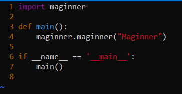
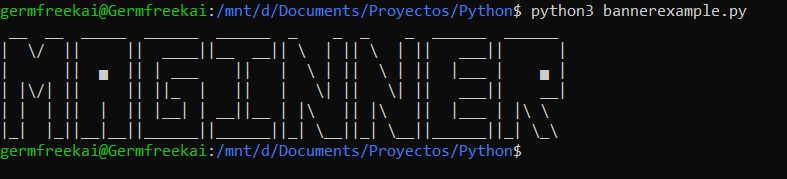

# Maginner
Easily create a banner to level up your program

---
## Use

This program is intended to help developers of command line utilities to beautify their tool by adding a simple quick Banner.

> On terminal: pip install maginner.

> import maginner as mg.

> mg.maginner("TOOL_NAME").

> Function maginner returns 1 if succesful. 

> Function maginner returns 0 if failed (Plus prints error message")




---
### Considerations 

Supported characters
```
- Alphabetic characters [A-Z]
- Blank spaces (' ')
- Dot ('.')
```

---
Note: I am looking forward to make improvements and add supported characters
If you have any advise, please let me know. 